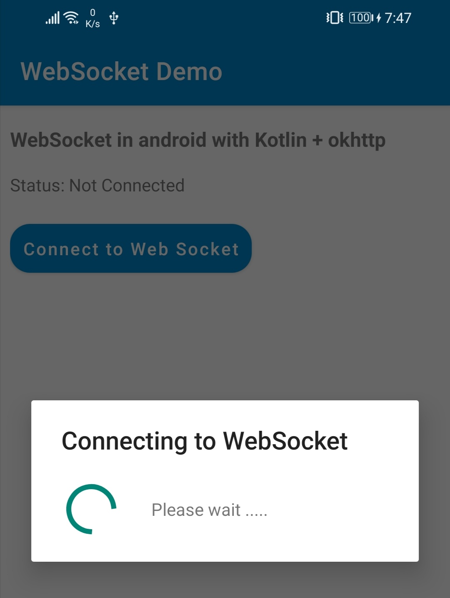
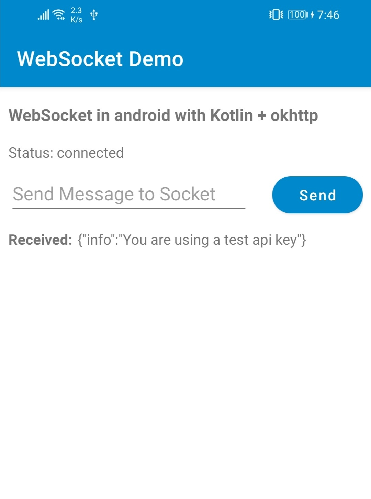
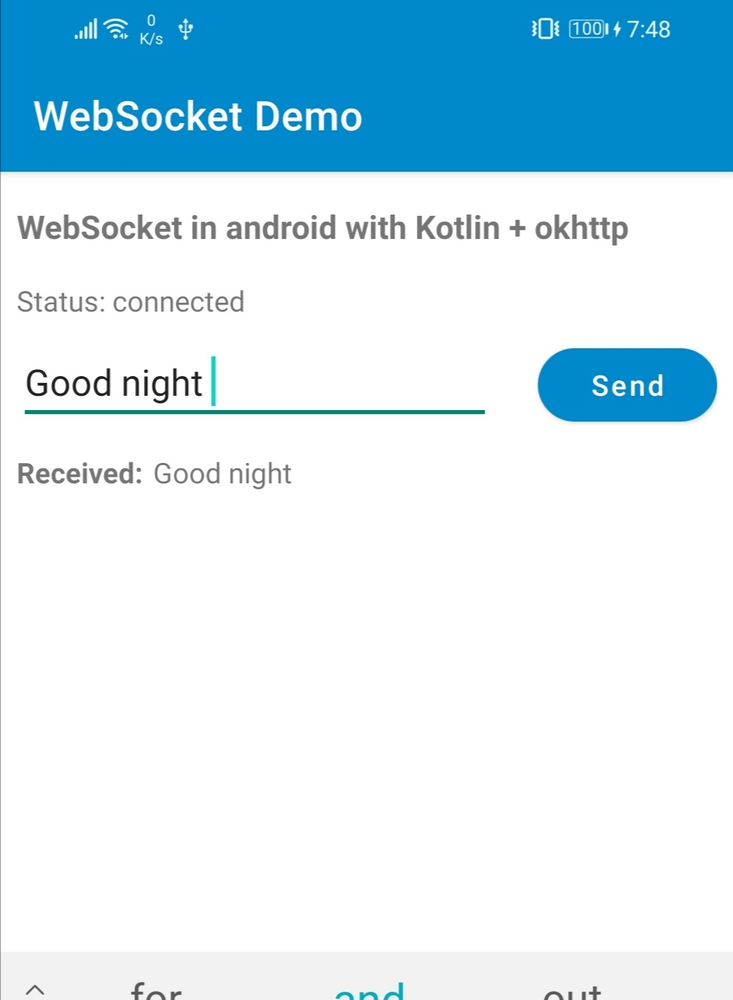

# WebSocket-Kotlin-Demo
This is the basic demo app showing WebSocket implementation on android using okhttp.

Here i used websocket server url from this site,
https://www.piesocket.com/websocket-tester
as a echo server. You can use your own server instead of this by changing socket url in SocketUtils class.

 &nbsp; &nbsp; 
&nbsp; &nbsp; 

